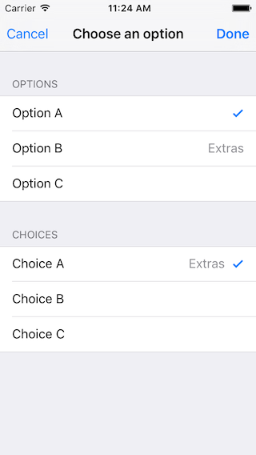
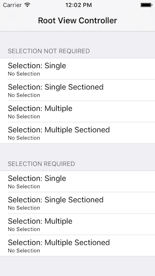
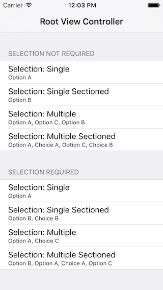

# SelectionViewController

Customisable Multi-select UIViewController for iOS.

## Features

* [x] Simple Set Up
* [x] Single & Multiple Selection
* [x] Sectioned Selection
* [x] Required Selection
* [x] Configurable UI

*Simple form showing sections of options with extra details and multiple selections.*

## Requirements

- iOS 8.0+
- Xcode 7.3
- Swift 2.2

## Installation

### Carthage

[Carthage](https://github.com/Carthage/Carthage) is the preferred dependency manager as it reduces build times during app development. SelectionViewController has been built for Carthage. Add 
	
	github "TheDistance/SelectionViewController"
	
to your cartfile and run
	
	carthage update SelectionViewController
	
to build the framework. Add to it your project according to the Carthage instructions.

## Usage

### UI

Currently, no default UI is provided. You should create a `TDSelectionViewController` in your Storyboard with cells with Reuse Identifier `Basic` and `Detail` (if `details` are provided - see below). Selection should be configured in a `UITableViewCell` subclass:

	class SelectionTableViewCell: UITableViewCell, SelectionCell {

    	@IBOutlet var titleLabel: UILabel?
    	@IBOutlet var detailLabel: UILabel?

    	override func setSelected(selected: Bool, animated: Bool) {
        	super.setSelected(selected, animated: animated)

        	// Configure the view for the selected state
        	accessoryType = selected ? .Checkmark : .None
    	}
	}

### Getting Started

When you want to show the selection, instantiate your selection view controller from the storyboard and configure the options using [`setOptions(_:withDetails:orderedAs:)`](). This is the key method to set up the data for the selection.

The data for a `TDSelectionViewController` is set using 4 properties:

* `options: NSDictionary<id, id>`: A dictionary linking unique keys to the value to display to the user. The default implementation assumes the values are strings, however you can subclass `TDSelectionViewController` and override `tableview(_:cellForRowAtIndexPath:)` to handle the values and details. Keys are used to allow for consistent referencing to a specific option with multiple localised display values.
* `sortedOptionKeys: NSArray<NSArray<id> *>`: An array of arrays of keys. This defines the sections, and order of the options in the sections.
* `sectionTitles: NSArray<NSString *>`: An array of titles for the section. This should have the same count as `orderedSectionKeys` otherwise an index out of bounds exception will be thrown.
* `details: NSDictionary`: A dictionary of the option keys and any extra objects that should be associated with this key.

The simple example in the screenshot above uses the following:

	let options = ["OA":"Option A",
                   "OB":"Option B",
                   "OC":"Option C",
                   "CA":"Choice A",
                   "CB":"Choice B",
                   "CC":"Choice C"]
    
    let order = [["OA", "OB", "OC"], ["CA", "CB", "CC"]]
    
    let sectionTitles = ["Options", "Choices"]
    
	let details = ["OB": "Extras", "CA": "Extras"]

	selectionVC.setOptions(options, withDetails: details, orderedAs: order)
	selectionVC.sectionTitles = sectionTitles
	
	
### Selection Behaviour

The behaviour of the selection is set using the `selectionType` and `requiresSelection` properties. The `SelectionType` enum has 4 values:

* **Single**: Only a single item can be selected. If `requiresSelection`, there must be one and only one selection.
* **SingleSectioned**: Only a single item in each section can be selected. If `requiresSelection`, one and only one item must be selected in each section.
* **Multiple**: Multiple items can be selected. If `requiresSelection`, at least one item from any section must be selected.
* **MultipleSectioned**: Multiple items in a given section can be selected. If `requiresSelection`, at least one item must be selected in each section.
    
If the selection criteria are not met by the user an alert is shown from the `dismissSelectionViewController(_:)` method. This alert can be configured by subclassing `TDSelectionViewController` and overriding one of

* `errorTitle()`
* `errorMessageForInvalidSelection()`
* `errorMessageForInvalidSectionedSelection()`
* `errorDismissButtonTitle()`

### Getting User's Selection

`TDSelectionViewController` has a `delegate` which is used to communicate results to the presenting view. 

* `selectionViewControllerRequestsDismissal(_:)`: The user's choices should be deemed chosen and the selection view dismissed. Their selection can be accessed through the `selectedKeys` property.
* `selectionViewControllerRequestsCancel(_:)`: The user's current selection on this view should be ignored and the selection view dismissed.

### Demo

This repo contains a simple demo that shows the features of this library.

## Communication

- If you have **found a bug**, open an issue.
- If you have **a feature request**, open an issue.
- If you **want to contribute**, submit a pull request.
- If you'd like to **ask a general question**, email us on <hello+keyboardresponder@thedistance.co.uk>.